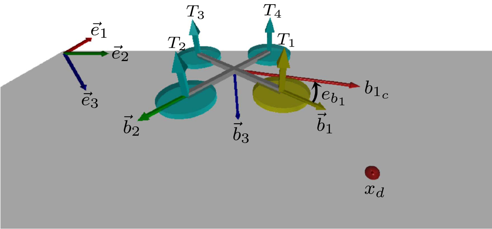
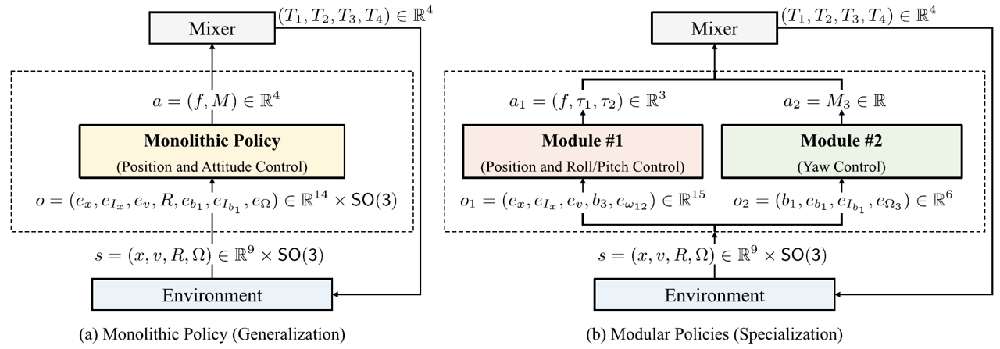
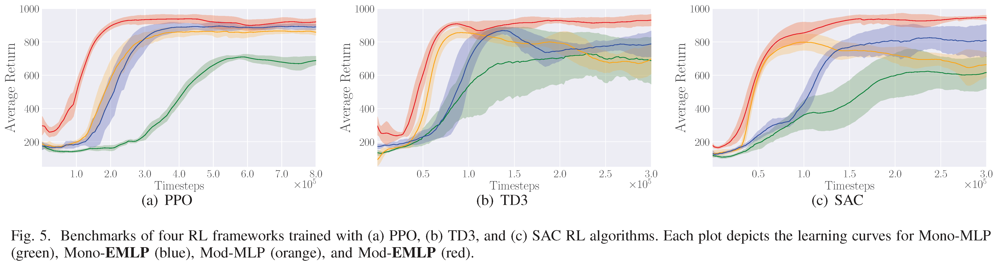

# gym-rotor

OpenAI Gym environments for a quadrotor UAV control, combined with modular RL and Equivariant RL approaches.


> **NOTE**: For training code presented at the ACC 2023 conference, *Equivariant reinforcement learning for quadrotor UAV*, please switch to the `ACC23` branch. For the ACC 2024 conference training code, *Multi-Agent Reinforcement Learning for the Low-Level Control of a Quadrotor UAV*, use the `ACC24` branch. After cloning the desired branch, please refer to the respective README.md for detailed instructions.

### ***Learn by Doing***

This repository contains OpenAI Gym environments and PyTorch implementations of [PPO](https://arxiv.org/abs/1707.06347), [SAC](https://arxiv.org/abs/1801.01290), and [TD3](https://arxiv.org/abs/1802.09477)/[MATD3](https://arxiv.org/abs/1910.01465), for low-level control of quadrotor unmanned aerial vehicles. 
To better understand **What Deep RL Do**, see [OpenAI Spinning UP](https://spinningup.openai.com/en/latest/index.html).
Please don't hesitate to create new issues or pull requests for any suggestions and corrections. 

## Installation
### Requirements
The repository is compatible with Python 3.11.3, Gymnasium 0.28.1, Pytorch 2.0.1, and Numpy 1.25.1.
It is recommended to create [Anaconda](https://www.anaconda.com/) environment with Python 3 ([installation guide](https://docs.anaconda.com/anaconda/install/)).
Additionally, [Visual Studio Code](https://code.visualstudio.com/) is recommended for efficient code editing.

1. Open a terminal and install major packages.
```bash
conda install -c conda-forge gymnasium
conda install pytorch torchvision torchaudio pytorch-cuda=11.8 -c pytorch -c nvidia
conda install -c anaconda numpy
conda install -c conda-forge vpython
```
> Refer to the official documentation for [Gymnasium](https://anaconda.org/conda-forge/gymnasium), [Pytorch](https://pytorch.org/get-started/locally/), and [Numpy](https://anaconda.org/anaconda/numpy), and [Vpython](https://anaconda.org/conda-forge/vpython).

2. Clone the repository.
```bash
git clone https://github.com/fdcl-gwu/gym-rotor.git
```

## Environments
Consider a quadrotor UAV below,



The position and the velocity of the quadrotor are represented by $x \in \mathbb{R}^3$ and $v \in \mathbb{R}^3$, respectively.
The attitude is defined by the rotation matrix $R \in SO(3) = \lbrace R \in \mathbb{R}^{3\times 3} | R^T R=I_{3\times 3}, \mathrm{det}[R]=1 \rbrace$, that is the linear transformation of the representation of a vector from the body-fixed frame $\lbrace \vec b_{1},\vec b_{2},\vec b_{3} \rbrace$ to the inertial frame $\lbrace \vec e_1,\vec e_2,\vec e_3 \rbrace$. 
The angular velocity vector is denoted by $\Omega \in \mathbb{R}^3$.
Given the total thrust $f = \sum{}_{i=1}^{4} T_i \in \mathbb{R}$ and the moment $M = [M_1, M_2, M_3]^T \in \mathbb{R}^3$ resolved in the body-fixed frame, the thrust of each motor $(T_1,T_2,T_3,T_4)$ is determined by

$$ \begin{gather} 
    \begin{bmatrix} 
        T_1 \\\ T_2 \\\ T_3 \\\ T_4
    \end{bmatrix}
    = \frac{1}{4}
    \begin{bmatrix}
        1 & 0      & 2/d   & -1/c_{\tau f} \\
        1 & -2/d & 0      & 1/c_{\tau f} \\
        1 & 0      & -2/d & -1/c_{\tau f} \\
        1 & 2/d   & 0      & 1/c_{\tau f} 
    \end{bmatrix}
    \begin{bmatrix}
        f \\\ M_1 \\\ M_2 \\\ M_3 
    \end{bmatrix}.
\end{gather} $$

### Training Frameworks
Two major training frameworks are provided for quadrotor low-level control tasks: (a) In a monolithic setting, a large end-to-end policy directly outputs total thrust and moments; (b) In modular frameworks, two modules collaborate to control the quadrotor: Module #1 and Module #2 specialize in translational control and yaw control, respectively. 
A detailed explanation of these concepts can be found in [this YouTube video](https://www.youtube.com/watch?v=-NQ6oRsdWgI).

<p align="center">
    
</p>

| Env IDs | Description |
| :---: | --- |
| `Quad-v0` | This serves as the foundational environment for wrappers, where the state and action are represented as $s = (x, v, R, \Omega)$ and $a = (T_1, T_2, T_3, T_4)$.|
| `CoupledWrapper` | Wrapper for monolithic RL framework: the observation and action are given by $o = (e_x, e_{I_x}, e_v, R, e_{b_1}, e_{I_{b_1}}, e_\Omega)$ and $a = (f, M_1, M_2, M_3)$.|
| `DecoupledWrapper` | Wrapper for modular RL schemes: the observation and action for each agent are defined as $o_1 = (e_x, e_{I_x}, e_v, b_3, e_{\omega_{12}})$, $a_1 = (f, \tau)$ and $o_2 = (b_1, e_{b_1}, e_{I_{b_1}}, e_{\Omega_3})$, $a_2 = M_3$, respectively.|

where the error terms $e_x, e_v$, and $e_\Omega$ represent the errors in position, velocity, and angular velocity, respectively.
Also, we introduced the integral terms $e_{I_x}$ and $e_{I_{b_1}}$ to eliminate steady-state errors.
More details are available in [our publication](https://ieeexplore.ieee.org/document/10777540).

## Examples
We evaluate monolithic and modular equivariant RL frameworks against their non-equivariant counterparts.
Specifically, we benchmark four distinct frameworks: two traditional non-equivariant approaches using standard multi-layer perceptrons (MLPs), namely **Mono-MLP** (Monolithic Policy with MLP) and **Mod-MLP** (Modular Policies with MLP), and two proposed equivariant approaches utilizing equivariant multilayer perceptrons (EMLPs), referred to as **Mono-EMLP** (Monolithic Policy with EMLP) and **Mod-EMLP** (Modular Policies with EMLP).
Additionally, we explore two inter-module communication strategies to optimize coordination across modules: centralized (`--module_training CTDE`) and decentralized (`--module_training DTDE`) coordination. 
In the decentralized setting, namely `DTDE`, modules independently learn their action value functions and policies without inter-agent synchronization.
In contrast, centralized methods, called `CTDE`, introduce centralized critic networks to share information between modules during training.
Lastly, we propose data-efficient, equivariant monolithic and modular RL by identifying the rotational and reflectional symmetries in quadrotor dynamics and encoding these symmetries into equivariant network models (`--use_equiv True`).
Hyperparameters can be adjusted in `args_parse.py` to further optimize performance.

### Training 
Use the following commands to train agents with different frameworks and equivariance settings:
```bash
# Mono-MLP (Monolithic Policy with MLP)
python3 main.py --framework MONO --use_equiv False
# Mod-MLP (Modular Policies with MLP)
python3 main.py --framework MODUL --use_equiv False
# Mono-EMLP (Monolithic Policy with EMLP)
python3 main.py --framework MONO --use_equiv True
# Mod-EMLP (Modular Policies with EMLP)
python3 main.py --framework MODUL --use_equiv True
```

### Testing
The trained models are saved in the `models` folder (e.g. `TD3_MONO_700.0k_steps_agent_0_1992`).
To evaluate them, first, modify `total_steps` value in `main.py`, e.g., for MONO schemes trained with TD3,
```bash
        # Load trained models for evaluation:
        if self.args.eval_model:
            if self.framework == "MONO":
                total_steps, agent_id = 700_000, 0  # edit 'total_steps' accordingly
                self.agent_n[agent_id].load(self.rl_algo, self.framework, total_steps, agent_id, self.seed)
```
Then, execute the following command to test, visualize, and log flight data:
```bash
python3 main.py --framework MONO --test_model True --save_log True --render True --seed 1992
```

### Plotting Results
While testing the trained models, you can save the flight data by adding the `--save_log True` flag.
Then the data will be saved in the `results` folder with a timestamped filename, such as `MODUL_log_20250303_120200.dat`.
To visualize the flight data, open `draw_plot.py` and update the `file_name` accordingly, i.e., `file_name = 'MODUL_log_20250303_120200'`.
Lastly, run the plotting script with the appropriate framework flag; For MODUL frameworks:
```bash
python3 draw_plot.py --framework MODUL
```
For MONO frameworks:
```bash
python3 draw_plot.py --framework MONO
```

## Results
The experiments demonstrate clear advantages of equivariant over non-equivariant approaches and modular over monolithic architectures in reinforcement learning for quadrotor UAV control. 
Equivariant models, **Mod-EMLP** (red) and **Mono-EMLP** (blue), consistently converge faster and achieve higher average returns compared to their non-equivariant counterparts, **Mod-MLP** (orange) and **Mono-MLP** (green).
Particularly, the **Mod-EMLP** model, combining equivariant learning with a modular architecture, shows superior early-stage performance and faster convergence due to parallel learning of translational and yawing motions. 
In contrast, monolithic architectures, particularly those employing non-equivariant models, exhibit slower learning and risk overfitting due to the complexity of simultaneously optimizing all control aspects.
A supplementary video is available [here](https://www.youtube.com/watch?v=TGBQTuKpbAw).



## Citation
If you find this work useful in your work and would like to cite it, please give credit to our work:
```bash
@article{yu2025equivariant,
  title={Equivariant Reinforcement Learning Frameworks for Quadrotor Low-Level Control},
  author={Yu, Beomyeol and Lee, Taeyoung},
  journal={arXiv preprint arXiv:2502.20500},
  year={2025}}

@article{yu2024modular,
  title={Modular Reinforcement Learning for a Quadrotor UAV with Decoupled Yaw Control},
  author={Yu, Beomyeol and Lee, Taeyoung},
  journal={IEEE Robotics and Automation Letters},
  year={2024},
  publisher={IEEE}}
```

## Reference:
- [reinmav-gym](https://github.com/ethz-asl/reinmav-gym): Reinforcement Learning framework for MAVs using the OpenAI Gym environment
- [PPO-Continuous-Pytorch](https://github.com/XinJingHao/PPO-Continuous-Pytorch): A clean and robust Pytorch implementation of PPO on continuous action space.
- [pytorch-soft-actor-critic](https://github.com/pranz24/pytorch-soft-actor-critic): PyTorch implementation of soft actor critic
- [TD3](https://github.com/sfujim/TD3): Author's PyTorch implementation of TD3 for OpenAI gym tasks
- [MARL-code-pytorch](https://github.com/Lizhi-sjtu/MARL-code-pytorch): Concise pytorch implements of MARL algorithms, including MAPPO, MADDPG, MATD3, QMIX and VDN.

